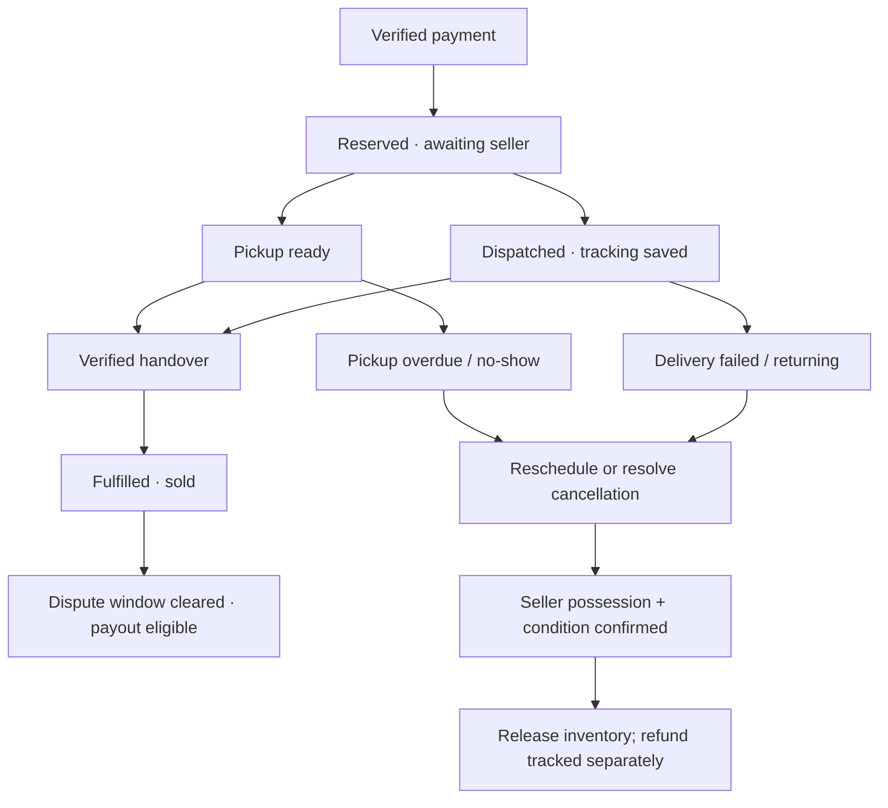

# ReWear — Remaining Functionality: Recommended Plan & Checklist

**Date:** 27 August 2026  
**Scope:** shipping/pickup, buyer/seller history, rental lifecycle, cancellation/extensions, deposits, commissions, earnings, notifications and footer.  
**Status:** notification module implemented and automatically tested; other modules remain planned. No live payment tests performed. User requirements and proposed defaults are distinguished below.

## Execution status — module 1 (notifications)

Implemented 27 August 2026: backend notification layers, WebSocket/STOMP authentication, transactional inbox/outbox, service triggers, persistent frontend inbox and customer/admin unread badges.

Verified: 6 notification integration tests + 1 existing password-reset regression test pass; targeted new-file ESLint passes; full production frontend build passes. Tests include real HTTP/WebSocket delivery to two sessions and concurrent recipient updates. User's production database was not modified by test runs.

Setup, limitations and migration script: [backend/NOTIFICATIONS.md](backend/NOTIFICATIONS.md). Still required: actual signed-in browser acceptance on the user's running stack and disposable-MySQL verification. Future fulfillment/rental/refund/payout notification triggers are not yet implemented because those workflows remain pending.

Build prerequisites also corrected: two existing admin enum/type mismatches and missing Suspense boundaries on rent, browse-finds, signup, verify-otp and OAuth callback pages.

The diagnosis below describes the pre-implementation baseline; notification entries have now been superseded by this status.

## Execution status — admin earnings reporting

Implemented 27 August 2026: /api/admin/earnings and the admin earnings page now report backend SUCCESS payments, 12% thrift and 20% rental fee allocations, seller share, six-month chart, search/pagination and reconciliation warnings. No mock transactions remain on this page.

Added nullable order-item fee/deposit/shipping/rate/seller snapshots for new checkouts, corrected the cart's daily-rate multiplication, and made the payment modal use the server-calculated total. Incomplete legacy rentals remain explicitly excluded for review rather than guessing deposit amounts.

This is payment reporting, not the planned payout/refund settlement journal. Seller earnings UI, cancellation, extension, deposit refunds and payouts are still pending. Details: [backend/EARNINGS.md](backend/EARNINGS.md). Verified: 6 earnings integration tests plus 7 existing notification/password-reset tests pass; production frontend build and targeted earnings lint pass. Tests did not contact payment gateways or modify the user's database.

## 1. Diagnosis: what exists and what is missing

| Current source | Finding |
|---|---|
| `order/OrderService`, `payment/PaymentService` | Payment success confirms an order and immediately marks thrift inventory sold out or rental inventory reserved. No fulfillment completion flow. |
| `frontend/lib/api/profileApi.ts` | Only confirmed orders are fetched for history; the profile summary hardcodes their status to Completed. Confirmed payment is being presented as completed delivery. |
| `order/modal/OrderItem.java` | No seller snapshot, fulfillment status, selected delivery details, numeric fee/deposit breakdown or return lifecycle. Price is a display string. |
| `frontend/app/(main)/cart/page.tsx` | Cart totals include shipping and deposits, but the order request does not send those as separate structured fields. |
| `GET /api/orders` | Buyer-only history. No equivalent seller sales/rentals query. |
| `profile/rentals/page.tsx` | Uses confirmed order items, not actual active-rental states. Extend/Return actions show a coming-soon toast. |
| `listing/entity/Listing.java` | One rental date window per listing, not a booking calendar. |
| Admin earnings/orders, notifications pages | Mock data. No refund/payout operations found in inspected gateway adapters. |
| Seller earnings | No dedicated seller earnings route found in this checkout; plan to add one rather than assume it exists. |
| `frontend/layout/Footer.tsx` | Every footer link currently points to #. |

**Root issue:** payment, physical possession, rental dates and money settlement need separate records/statuses. Adding more frontend labels alone will not solve this.

## 2. Requirements versus recommended defaults

### Requirements supplied by the owner

- Thrift commission: **12%**; rental commission: **20%**, deducted from seller proceeds.
- History must show both purchases and sales.
- Rentals must show both items rented by me and items rented out by me.
- Seller tracks shipping/pickup and return receipt; buyer can request extensions and eligible cancellation.
- Buyer rental cancellation allowed only before the starting calendar date. On/after that date, disable and reject cancellation.
- Eligible rental cancellation retains **10%**, refunds the remainder.
- Rental deposit is temporarily held by the platform and refunded after confirmed return.
- Real admin/seller earnings, notifications, and useful footer links.

### Proposed defaults — obtain approval before implementing money rules

| Unspecified decision | Recommended starting policy |
|---|---|
| Commission base | Thrift merchandise subtotal or rental usage fee only; exclude refundable deposit and shipping. |
| Meaning of 10% cancellation charge | 10% of rental usage fee, not total checkout. It replaces normal 20% rental commission for that cancelled booking; do not charge both. |
| Who receives cancellation charge? | Platform for MVP; disclose it. Seller compensation/splitting needs a separate agreed rule. |
| Shipping refund on cancellation | Full refund if unspent; documented nonrecoverable shipping may be retained only under an explicitly accepted policy. |
| Seller fault, unavailable item, platform failure | Full affected-item refund, including deposit and unspent delivery; no buyer cancellation penalty. |
| Thrift no-show penalty | No invented percentage. Start with reminders/rescheduling and documented shipping-cost handling, then admin resolution. |
| Pickup deadline | Configurable deadline agreed/shown at checkout; example starting default: 72 hours after ready notification, not a fixed requirement. |
| Payout release | Thrift: verified handover plus a disclosed dispute window. Rental: confirmed acceptable return plus dispute clearance. |
| Deposit disputes | Refund full deposit after acceptable return; damage/loss deductions require evidence and dispute resolution, not a seller's unilateral toggle. |
| Rental duration | Start/end dates inclusive, with explicit local handover/return times. Confirm this convention before migrating existing bookings. |

Use **Asia/Kathmandu** for business-date rules and store event timestamps in UTC. Proposed timing/grace periods are configurable policy, not established existing behavior.

## 3. Lifecycle design

Keep lifecycle at the **order-item level**: one cart can contain multiple sellers and a mixture of sale/rental items. The parent order is a checkout/payment aggregate whose displayed status is derived from its items. One failed delivery must not cancel another seller's completed item.

Separate:

- Payment: pending, paid, partially refunded, refunded; retain individual payment-attempt outcomes.
- Fulfillment: awaiting seller, ready for pickup / dispatched, received; plus delivery failure/return-to-seller branches.
- Rental: booked, active, return requested/in transit, returned pending inspection, completed; cancellation branch.
- Refund and payout: requested/pending, processing, succeeded, failed/requires review.
- Inventory: payment hold, reserved for fulfillment, rented/unavailable, available, sold; publication/moderation status remains separate.

Overdue is derived from deadline + outstanding possession, not proof of permanent loss. A dispute is a separate case which can block settlement without destroying the underlying history.

### Thrift: shipping or pickup



**Who updates what?**

| Action | Authorized actor / evidence |
|---|---|
| Accept / prepare / ready for pickup | Owning seller |
| Dispatch | Owning seller; carrier, tracking/reference and timestamp |
| Confirm pickup | Buyer-held one-time pickup code verified by backend at handover; expiry and attempt limits |
| Confirm shipping receipt | Buyer; alternatively verified carrier evidence with a disclosed dispute process |
| Mark failed attempt / no-show | Seller or trusted delivery event, after the deadline; not automatic completed status |
| Confirm return to seller | Owning seller with condition/evidence |
| Resolve contested delivery/cancellation | Admin with reason and audit trail |

**Buyer never collects the item:** keep it reserved while reminders/rescheduling are active. On resolved cancellation, confirm that the seller physically possesses a saleable item before relisting. If an item is still in transit, lost, damaged or disputed, do not relist it. Releasing inventory and issuing a refund are separate operations: an unpaid refund must remain visible even if safe relisting is approved.

For thrift, hide/disable purchase while reserved; optionally show Unavailable. Mark permanently sold after verified handover, not merely payment. Do not delete history on cancellation or relisting.

## 4. Buyer and seller pages

### Order history / My Orders

Add **Purchases | Sales** tabs, with All / In progress / Completed / Cancelled / Refund pending / Disputed filters. History can include an order immediately after checkout; its status must be truthful.

Show each item's order-item ID, actual transaction type, counterparty, payment/fulfillment status, delivery method, timeline, amount breakdown and permitted next actions. Sellers see only their own items and necessary buyer contact/delivery data, never another seller's lines.

### Rentals

Add **Renting | Renting out** tabs with Upcoming / Active / Return pending / Overdue / Completed / Cancelled filters.

- Buyer: view instructions, confirm receipt, cancel before cutoff, request extension, initiate return, view deposit/refund.
- Seller: prepare/dispatch/confirm pickup, review extension, confirm physical return and condition, raise a documented issue.
- System: flags overdue rentals; seller can report not received, but cannot automatically seize the deposit.
- Admin: resolve disputed handover, return, loss or refund.

Return initiation by a buyer is not return receipt by a seller. For normal return, seller confirms acceptable receipt, then the backend queues the deposit refund. If seller does not respond, reminders and admin escalation prevent indefinite deposit holds.

Expose server-computed `allowedActions`, disabled reasons and relevant deadlines; frontend hides/disables buttons accordingly, while backend independently enforces every rule.

## 5. Rental cancellation and extension

### Cancellation rule

For a rental **29–31 August 2026**, with Nepal business time:

- 28 August 23:59:59: eligible, subject to no prior handover/dispatch restrictions.
- 29 August 00:00 onward: ordinary buyer cancellation is disabled and API-rejected.
- Early handover/dispatch before the start date needs a return/intervention workflow; it must not be treated as an untouched booking cancellation.
- Seller fault/disputes remain support cases after the cutoff. Disabling ordinary cancellation does not eliminate those remedies.

The original start-date cutoff must not be reset by extension. Evaluate it with the server clock inside the transaction; a UI opened before midnight cannot bypass it.

**Proposed example, no shipping:**

| Component | NPR |
|---|---:|
| Rental fee | 1,000 |
| Security deposit | 2,000 |
| Total paid | 3,000 |
| Cancellation charge: 10% of fee | 100 |
| Refund: 900 fee + 2,000 deposit | **2,900** |

On approval: cancel booking/release its date hold, record refund obligation and reversal of normal pending earnings, create an idempotent refund request. Show Refund pending until actual gateway/manual transfer confirmation. Repeated clicks must not repeat refunds.

### Extension

1. Buyer selects new return date; server checks ownership, booking state, conflicts, cleaning/turnaround buffer and maximum duration.
2. Seller approves proposed dates for MVP; approval expires after a configurable payment window.
3. Backend reserves the additional interval and quotes the incremental fee using snapshotted policy/rate.
4. Buyer pays the extra amount. Only verified successful payment commits the extension.
5. Apply 20% commission to the incremental rental fee; keep original deposit unchanged unless an explicitly approved policy requires a top-up.
6. Failed/expired payment leaves original dates and charges intact. Late successful payment after expiry requires revalidation or refund review.

Do not allow ordinary extension after return/cancellation or while disputed. For MVP, overdue extension requires admin review. Record every extension separately; never overwrite the original pricing/history.

## 6. Money: commission, deposit, refunds and payouts

**A number on an earnings page is not a bank transfer.** Current adapters initiate/verify payments; refund support, partial refunds, merchant settlement and seller payout mechanisms must be verified with each provider before enabling live automation. Do not call platform-held deposits legal escrow or assume automatic split settlement.

### Normal calculations — recommended commission base

| Transaction | Buyer pays | Platform commission | Seller merchandise/rental proceeds |
|---|---:|---:|---:|
| Thrift | 1,000 | 120 | 880 |
| Rental | 1,000 fee + 2,000 deposit | 200 | 800 |

Shipping is a separate pass-through allocation; decide whether paid to seller or delivery provider. Gateway fees must have a separately agreed allocation. The deposit is **refundable liability**, not platform revenue or seller earnings.

At payment verification, record pending allocations. At fulfillment/return and dispute clearance, make seller proceeds payout-eligible and recognize finalized commission under the agreed policy. Show pending and finalized figures separately.

### Required accounting controls

- Store integer paisa consistently (or a rigorously consistent decimal-money type); never calculate money from formatted strings or floating-point UI values.
- Snapshot fee, deposit, shipping, commission rate, cancellation policy/version and rounding at checkout.
- Maintain an immutable balanced money journal with reversal entries, linked to payment/order-item/refund/payout IDs. Keep seller pending/available balances separate from deposit liabilities.
- Refund requests need amount, reason, recipient, original payment, gateway reference, status, retries and evidence. Support partial refunds in mixed-item orders.
- Deposit refund can succeed independently of seller payout. Mark it refunded only after external confirmation; failed refunds remain retryable.
- A dispute freezes only affected funds. After resolution, refund/deduct exactly the approved amount; never silently confiscate a whole deposit for a late return.
- Pending → available → paid-out seller earnings; queued payouts alone must not appear as Paid.
- First release can use an audited admin-assisted transfer flow if automated payout/refund is unavailable. Require transfer evidence and reconciliation.
- Retain provider initiation IDs and final transaction IDs separately; current Khalti field reuse should be removed.
- Reconcile late/missing payment callbacks, refund/payout outcomes and journal balances. A browser success redirect must not be the only source of payment completion.

## 7. Backend schema and API plan

Build within the existing Spring application; separate services by responsibility, not new deployed microservices.

| Record / module | Minimum additions |
|---|---|
| OrderItem | Seller ID/snapshot; explicit THRIFT or RENT purchase type (not listing's combined offer mode); trusted numeric prices, fees, deposit and policy snapshots; item lifecycle/version |
| Fulfillment | Selected pickup/shipping method, address/contact snapshot, deadlines, dispatch/tracking, receipt evidence, reverse-delivery state |
| RentalBooking | Listing + order-item, dates, actual handover/return, inspection, date reservations and version |
| RentalExtension | Proposed dates, approval/expiry, quote, linked incremental payment |
| InventoryReservation | Listing/date interval, checkout hold expiry, converted/released status |
| Money journal / Refund / Payout / DepositHold | Allocations, obligations, outcomes, references and reconciliation |
| Dispute / StatusHistory | Actor, reason, evidence, before/after state and timestamps |
| Notification / OutboxEvent | Recipient, type, entity reference, read time, deduplication and delivery state |

For single physical garments, serialize competing reservations using database transactions/locking. A purchase must not conflict with any active/future rental; a combined THRIFT_AND_RENT listing still has only one physical item. A rental ending by date does not prove the garment was returned.

**Proposed endpoints (not existing API claims):**

| API family | Purpose |
|---|---|
| `GET /api/orders?role=buyer|seller&status=...` | Paginated, principal-scoped history |
| `GET /api/order-items/{id}` | Item detail/timeline/permitted actions |
| `POST /api/order-items/{id}/ready-for-pickup`, `/dispatch`, `/confirm-receipt` | Explicit guarded fulfillment actions |
| `POST /api/order-items/{id}/report-issue` | No-show, failed delivery, dispute |
| `GET /api/rentals?role=buyer|seller` | Booking-based rental views |
| `POST /api/rentals/{id}/cancel`, `/extensions`, `/return-request`, `/confirm-return` | Role-specific rental actions |
| `GET /api/earnings/me`, `/api/admin/earnings` | Seller and platform summaries/details |
| `GET /api/notifications`, `/unread-count`; read/read-all actions | Persistent inbox |
| Admin refund/payout/dispute actions | Reviewed money operations and exception resolution |

Use idempotency keys and unique operation constraints for money actions; use state/version checks for concurrent transitions. Avoid generic “set any status” endpoints. Authorize every query and mutation server-side.

## 8. Notifications and footer

### Notifications — required real-time WebSocket implementation

**Owner update:** use Spring WebSocket, not polling as the primary transport. Persist notifications in MySQL, deliver live updates to authenticated users, and replace hardcoded navbar badges. This section supersedes the earlier polling-first recommendation. This is an implementation specification, not a claim that the code is already built.

Add this dependency to `backend/pom.xml` (version managed by the existing Spring Boot parent):

```xml
<dependency>
    <groupId>org.springframework.boot</groupId>
    <artifactId>spring-boot-starter-websocket</artifactId>
</dependency>
```

#### Backend module structure

Use `com.rewear.backend.notification` with the complete layers requested:

```text
notification/
  model/Notification.java
  model/NotificationOutboxEvent.java
  model/NotificationInboxState.java
  enums/NotificationType.java
  dto/request/MarkAllNotificationsReadRequest.java
  dto/response/NotificationResponse.java
  dto/response/NotificationPageResponse.java
  dto/response/NotificationUnreadResponse.java
  dto/response/NotificationEventResponse.java
  repository/NotificationRepository.java
  repository/NotificationOutboxRepository.java
  repository/NotificationInboxStateRepository.java
  mapper/NotificationMapper.java
  service/NotificationService.java
  service/impl/NotificationServiceImpl.java
  service/NotificationOutboxDispatcher.java
  controller/NotificationController.java
  config/NotificationWebSocketConfig.java
  security/NotificationStompAuthInterceptor.java
```

Use `model` for the entity directory (the requested “modal” layer); keep existing unrelated `modal` packages unchanged.

**Notification fields:** ID, recipient user relation, type, title, message, related entity type/ID, safe relative destination, createdAt, readAt, per-recipient sequence and unique event/recipient deduplication key. Index recipient + sequence and recipient + readAt. Never send JPA entities or token/OTP/payment secrets in messages.

**Inbox state:** a per-user revision/sequence, changed atomically with notification creation/read operations. Return authoritative unread count plus revision; clients ignore stale revisions. Maintain unreadCount in the locked inbox-state row, updated in the same transaction as creation/read operations. This is a persistent transactional counter, not browser arithmetic; reconcile against unread records when diagnosing discrepancies. Locking reads avoid stale state inside existing MySQL business transactions.

**Service interface:** internal methods for publishing a business event to intended recipients, listing the current user's inbox, getting unread state, marking one read and marking all through a supplied server-issued sequence watermark. Recipient IDs come from backend business records, never arbitrary browser inputs. Inject NotificationService into relevant business services, not only controllers.

#### Durable publication and real-time delivery

1. Business service creates the recipient notification, updates its locked inbox state and writes a delivery outbox row in the same transaction as the business state change.
2. After commit, the dispatcher publishes the stored state event. Notification creation is deduplicated by recipient/event key; delivery can retry independently.
3. Send a typed event through Spring's messaging template to that authenticated user's queue; never a shared public notifications topic.
4. Mark-read operations also publish state-change events after commit to every session for the same user.
5. Retry failed delivery without inserting duplicate inbox records. A crash after sending can duplicate an event, so clients also deduplicate event IDs.
6. Offline users keep their notifications in MySQL. Reconnect uses REST to recover; a WebSocket send is not proof that a human received/read it.

A database/outbox insertion failure rolls back the enclosing atomic operation; external payment success must then be recovered through payment reconciliation. Socket/email delivery failure after commit must not undo a successful business operation.

#### WebSocket authentication and routing

- Proposed transport: STOMP over native WebSocket, endpoint `/ws/notifications`, subscription `/user/queue/notifications`.
- Add a compatible `@stomp/stompjs` client after checking local dependency compatibility at implementation time. SockJS is optional only if an actual transport need is demonstrated.
- Browser native WebSocket cannot set arbitrary HTTP Authorization headers. Carry the access JWT in STOMP CONNECT headers, validate it in an inbound channel interceptor, and bind the verified identity as the socket Principal.
- Ensure the HTTP handshake can reach this endpoint without requiring a Bearer header that browsers cannot send, but allow no subscription until STOMP authentication succeeds.
- Use the same canonical principal identifier for CONNECT and server `convertAndSendToUser` routing; do not mix numeric user ID and email.
- Allow only the personal queue subscription; deny broad `/topic/**`, other users' destinations and arbitrary client SEND operations. Read actions use authenticated REST.
- Enforce allowed origins, frame/rate limits and TLS in deployed environments. Do not put JWTs in query strings or logs.
- Expired sessions must stop receiving protected data; refresh via the existing REST token flow and reconnect with the new token. Logout/account switch tears down the old connection and clears inbox state.
- Ban/revocation must disconnect affected sessions or deny further delivery, not merely reject the next login.
- Start with Spring's simple broker for a single backend instance. Multi-instance deployment requires shared broker/event routing before promising delivery across nodes.
- Check exact Spring Security/STOMP integration against the installed Boot/Security versions during implementation; do not assume HTTP JWT filtering authenticates STOMP frames.

#### REST contract and events

| Endpoint | Behavior |
|---|---|
| `GET /api/notifications?cursor=...&unreadOnly=...` | Current user's paginated inbox; stable order, latest sequence watermark and unread state |
| `GET /api/notifications/unread-count` | `{ unreadCount, revision }` from database |
| `PATCH /api/notifications/{id}/read` | Idempotent owner-only read; returns updated unread state |
| `PATCH /api/notifications/read-all` | Marks current user's notifications through supplied watermark; returns updated unread state |

Event envelope: `eventId`, `type` (NOTIFICATION_CREATED / NOTIFICATION_READ / NOTIFICATIONS_READ_ALL / INBOX_CHANGED), `revision`, `unreadCount`, affected ID/watermark, and optional notification DTO. All data is scoped to the recipient.

**Mark all semantics:** mark notifications through the inbox's known watermark, so a concurrently arriving new notification is not silently read. If none arrived afterward, the unread count becomes zero and the red badge disappears. If one genuinely new unread notification arrived, show its count. Never blindly set zero before the server confirms success.

#### Frontend integration

- Add `frontend/lib/NotificationContext.tsx`, notification API/types and a reusable socket hook/client.
- Mount one NotificationProvider per browser tab below AuthProvider; navbar and notification page consume the same store.
- On login: connect and subscribe, buffer incoming events while loading the initial REST snapshot, then reconcile by revision. Refresh snapshot after reconnect or revision gaps.
- Replace `frontend/layout/Navbar.tsx`'s current `useState(2)` with real unread count for both desktop and mobile.
- Replace `components/admin/AdminNavbar.tsx`'s default count of 3, dummy notifications and local-only mark-read behavior with the same provider.
- Render the red circle only when `unreadCount > 0`; never show a fake default while loading. Optional 99+ visual cap must preserve actual accessible count.
- Replace the mock `/notifications` page with paginated persisted notifications and single/read-all actions.
- After mark-all succeeds, apply the returned unread state immediately and broadcast the same committed state via WebSocket to other tabs/devices.
- Handle request failure, reconnect with backoff, duplicate/out-of-order messages, token refresh and React effect cleanup. No duplicate sockets caused by rerenders.
- A reconnect/focus REST resync is a safety mechanism; routine polling is not the primary live-update mechanism.

#### Service injection points

Send only on actual successful transitions; never on a page view or every GET. Repeated payment callbacks must not create repeated notifications.

| Service / event | Recipients |
|---|---|
| Existing PaymentService: verified payment | Buyer confirmation; each owning seller receives only their sold/rented items |
| Existing ListingServiceImpl: submitted for review, approved/rejected | Admins for review; owning seller for decision |
| Existing ReportServiceImpl: report created/resolved | Admins for new report; reporter and affected party only for appropriate non-sensitive resolution details |
| Existing DonationServiceImpl / organization management | Authenticated donor for submission/status; admins for new donation; guest gets no fabricated user inbox |
| Existing AdminUserService: ban/unban | Affected user where delivery is allowed; critical email as appropriate. Banned sockets must still be revoked |
| Future fulfillment service: ready/shipped/failed/no-show | Buyer and owning seller as appropriate |
| Future rental service: booked, extension request/decision/payment, due/overdue, return | Buyer + owning seller, tailored to action |
| Future refund/deposit/payout service: requested/succeeded/failed | Money recipient; admins for processing failures |
| Future dispute service: opened/resolved | Parties and admins with role-appropriate details |

Current services are wired first. Future triggers must be added when their real workflows exist; do not generate synthetic shipment/refund/return notifications for unimplemented actions. Reminder jobs need persisted deadline/recipient deduplication keys. Critical emails supplement, not replace, the stored inbox. Safe deep links must recheck access.


### Footer

Replace label-only arrays with `{ label, href }` and real internal links:

- Shop: Browse finds → `/browse-finds`, Rent → `/rent`, Donate → `/donate`.
- Sell/account: List an item → `/list-items`, My orders → `/profile/order-history`, Rentals → `/profile/rentals`; use existing auth redirect conventions.
- Help: create real Shipping & Pickup, Returns & Rental Cancellation, Deposit Policy and Contact pages before linking.
- FAQ: add a real homepage anchor before using `/#faq`; no anchor was found in the inspected FAQ component.
- Remove unsupported Careers, Press, Winter Edit and similar placeholders unless real destinations are built.
- Add seller earnings link only when its new route exists. Check keyboard access, mobile layout, private-route redirects and no dead links.

## 9. Implementation sequence and checklist

### Phase 0 — agree policy and capture baseline

- [ ] Approve the cancellation base/recipient, shipping treatment, deadlines, dispute windows and payout release policy.
- [ ] Confirm provider refund/partial-refund and payout capabilities; select manual fallback if needed.
- [ ] Document time zone, inclusive dates, day rate, rounding, cleaning buffer and return condition policy.
- [ ] Capture current checkout/history tests and database backup; no live transactions during development.

### Phase 1 — correctness and schema foundation (blocker for real-money launch)

- [ ] Enforce admin roles/method security and seller/buyer ownership; reject self-purchases.
- [ ] Remove secret fragments from payment logs; constrain redirect URLs.
- [ ] Server-side price, deposit, shipping and availability calculation; reject tampered totals.
- [ ] Introduce versioned migrations and structured item snapshots, bookings and status history.
- [ ] Build database-enforced reservation concurrency and short checkout hold expiry.
- [ ] Handle multiple payment attempts, delayed success and unknown gateway outcomes without prematurely cancelling a paid order.
- [ ] Build ledger/refund/payout foundations and transactional outbox before lifecycle actions move money.

### Phase 1A — real-time notification foundation and existing integrations

- [x] Add spring-boot-starter-websocket dependency and complete notification model/repository/DTO/mapper/service/controller module.
- [x] Add a reviewable MySQL creation script, durable outbox, inbox revisions and paginated/read/unread REST APIs.
- [ ] Apply/review the script against a disposable MySQL database; automatic migration-runner adoption remains Phase 1 work.
- [x] Authenticate STOMP CONNECT and restrict subscriptions to the current user's personal queue.
- [x] Wire existing payment/listing/report/donation/user-management service transitions with deduplication.
- [x] Add NotificationProvider and STOMP client; replace customer/admin navbar mock counts and mock inbox.
- [x] Verify backend read-all broadcasts zero to both authenticated WebSocket sessions.
- [ ] Verify actual browser red-badge disappearance across tabs/devices on the user's running application.
- [ ] Verify offline recovery, expired JWT/logout cleanup, multi-user isolation and out-of-order events.

### Phase 2 — thrift fulfillment and both-side order history

- [ ] Persist selected shipping/pickup information and seller identity.
- [ ] Implement ready/dispatch/receipt/no-show/return-to-seller transitions and audit evidence.
- [ ] Add buyer/seller history tabs; remove hardcoded Completed and confirmed-only filtering.
- [ ] Reserve at payment; mark sold at handover; safely relist resolved undelivered items.
- [ ] Add deadline reminders, disputes and pending seller/platform allocations.

### Phase 3 — rentals and deposits

- [ ] Booking-based buyer/seller views with actual active/returned states.
- [ ] Enforce Nepal midnight cancellation cutoff and approved 10% refund calculation.
- [ ] Implement atomic cancellation, reservation release and refund obligation.
- [ ] Implement extension approval, quote, hold, incremental payment and conflict checks.
- [ ] Implement return initiation, seller inspection, disputes and deposit refund tracking.
- [ ] Keep overdue items blocked until physical return; handle affected future bookings.

### Phase 4 — earnings and settlement

- [x] Connect admin earnings to backend verified-payment reporting; remove mock calculations.
- [ ] Replace reporting projections with settlement-journal-backed balances when refunds/payouts are implemented.
- [ ] Add seller earnings route with gross, deductions, pending, available, paid and refund adjustments.
- [ ] Separate deposits held, platform commission and seller liabilities in admin totals.
- [ ] Support item-level partial refunds, commission reversals and payout review.
- [ ] Reconcile providers and verify balances before any payout/refund goes live.

### Phase 5 — complete notification UI and navigation

- [ ] Complete future workflow notification triggers throughout Phases 2–4 using the WebSocket foundation built in Phase 1A.
- [ ] Add read/unread states, safe links, retry monitoring and critical emails.
- [ ] Replace footer placeholders and publish accurate policy pages.
- [ ] Update stack guide/API documentation and remove stale coming-soon handlers.

### Phase 6 — migration and release gates

- [ ] Backfill sellers only from trustworthy listing relationships; deleted/unknown cases go to review.
- [ ] Do not reconstruct historical deposit/shipping from today's listing prices or silently assume zero.
- [ ] Do not translate legacy CONFIRMED into DELIVERED/COMPLETED. Mark fulfillment unknown pending review.
- [ ] Identify existing overlap/double-sale cases and unresolved payments before enabling payouts.
- [ ] Roll out behind feature flags; preserve old histories and block uncertain legacy automatic settlements.
- [ ] Run backend tests, frontend lint/build and both-user/admin end-to-end scenarios.

## 10. Acceptance-test checklist

- [ ] Paid order appears as in-progress, not completed; buyer and correct seller see the same timeline.
- [ ] Two sellers in one order: one item's cancellation/refund leaves the other untouched; privacy is preserved.
- [ ] Forged totals, deposit values, owner IDs, pickup codes and status transitions are rejected.
- [ ] Simultaneous buyers cannot buy/book the same inventory or overlapping rental dates.
- [ ] Pickup no-show triggers reminders/escalation; safe relisting preserves cancellation/refund history.
- [ ] Failed shipping cannot relist while parcel is in transit or disputed.
- [ ] Completed thrift: NPR 1,000 produces NPR 120 commission + NPR 880 seller amount, excluding delivery.
- [ ] Completed rental: NPR 1,000 fee produces NPR 200 commission + NPR 800 seller amount; NPR 2,000 deposit stays separately refundable.
- [ ] 29–31 August booking: cancellation on 28th succeeds; at Nepal midnight on 29th and afterwards fails, including direct API attempts.
- [ ] Approved cancellation example refunds NPR 2,900 of NPR 3,000; no extra 20% charge or duplicate refund.
- [ ] Seller-fault cancellation does not apply the buyer penalty.
- [ ] Extension conflicts, failed payment, expired approval and concurrent return are handled without corrupting dates.
- [ ] Return confirmation queues one deposit refund; failed transfer stays pending/failed, not Refunded.
- [ ] Non-return opens overdue/dispute handling, not automatic deposit forfeiture.
- [ ] Duplicate callbacks/retries create no double commission, refund, payout or notification.
- [ ] Provider timeout/late payment is reconciled even when the browser never visits the success page.
- [ ] Partial refunds, gateway fees, deposit liabilities and seller payouts reconcile to recorded collections.
- [ ] Notifications persist offline and arrive live without reload in customer/admin navbar and inbox.
- [ ] Mark-one/read-all updates the database and badge across tabs/devices; zero hides the circle.
- [ ] A new notification concurrent with mark-all stays unread beyond the marked watermark.
- [ ] Stale/duplicate events cannot restore an obsolete unread count; reconnect reconciles missed events.
- [ ] Users cannot subscribe to another inbox; invalid/expired JWTs, logout and bans stop protected delivery.
- [ ] Rolled-back business actions create no notifications; retrying committed events creates no duplicates.
- [ ] Notification socket/email outage does not roll back committed payments; outbox recovery preserves messages.
- [ ] Notifications are recipient-scoped and link to accessible records.
- [ ] Every footer link has a real destination; private destinations redirect through login correctly.

## Recommendation

Implement **trusted order-item records and money foundations first**, then fulfillment and rentals, then connect earnings screens. Notifications should be emitted as those workflows are added. Do not begin with dashboard totals: accurate earnings depend on accurate delivery, cancellation, return and refund events.


