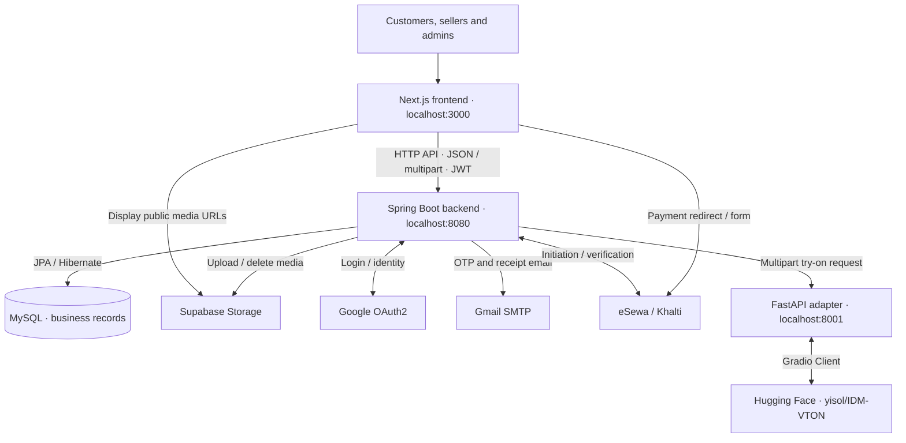

# ReWear — Stack & Ecosystem Guide

> Source snapshot: 27 August 2026. Based on code inspection, not a successful live deployment or end-to-end test. Use this as an orientation map; check current implementation before changing contracts.

## 1. What ReWear does

ReWear is a clothing resale, rental, and donation application. People list garments, browse and save items, buy or rent through online checkout, donate to organizations, and preview clothing with AI virtual try-on. Admin screens support moderation and management, although some screens still use mock data.

**Architecture:** one Next.js frontend, one Spring Boot backend organized by business domain, and one small Python service that connects to an external AI model. MySQL stores business records; Supabase Storage holds media. This is a modular backend plus an AI adapter, not a separate microservice for every feature.

## 2. Technology and responsibility

| Area | Stack declared in this repository | Responsibility |
|---|---|---|
| Frontend | Next.js 16.2.x, React 19.2.x, TypeScript 5 | App Router pages, forms, browsing, checkout and admin UI |
| Presentation | Tailwind CSS 4, Lucide React, React Toastify | Styling, icons and user feedback |
| Maps | Leaflet 1.9.x, React Leaflet 5 | Location/pickup map UI |
| API client/state | Axios; React Context; localStorage | API requests, token handling and browser state |
| Backend | Java 17, Spring Boot 4.0.6, Maven, Lombok | Business workflows, HTTP endpoints and integrations |
| Persistence | Spring Data JPA / Hibernate, MySQL Connector/J | Relational records; currently Hibernate schema update |
| Security | Spring Security, BCrypt, Google OAuth2, JJWT 0.12.6 | Passwords, login, access/refresh JWTs |
| Media | Supabase Storage through backend HTTP calls | Listing photos/video, profile and generated imagery |
| AI adapter | Python, FastAPI 0.115.0, Uvicorn 0.32.0, Gradio Client 1.6.0, HTTPX | Calls hosted IDM-VTON; does not run model weights locally |

Versions are manifest declarations, not a verified inventory of installed packages. WebFlux is included for WebClient integration; it does not make the JPA application fully reactive.

## 3. Main workflows

- **Identity:** email/password or Google login produces an application session using JWTs. The frontend stores tokens/user data in localStorage and sends Bearer tokens. The shared Axios client attempts refresh after a 401. Spring also allows sessions when required for OAuth2 state; this is not an entirely stateless configuration. Password reset uses email OTP/reset-token flows.
- **Listings:** seller input and multipart media reach Spring; media is uploaded to Supabase and URLs are saved with MySQL listing records. Modes are `THRIFT`, `RENT`, and `THRIFT_AND_RENT`. Publishing a new listing, or a draft, sends it to `PENDING_REVIEW`. The normal browse query returns `PUBLISHED` listings excluding `SOLD_OUT`; individual, seller and search queries have separate behavior.
- **Checkout:** browser cart → `POST /api/orders` → `PENDING_PAYMENT` order and item snapshots → `/api/payments/initiate` → gateway redirect/form → frontend success page calls `/api/payments/verify`. Verification success sets payment `SUCCESS`, order `CONFIRMED`, sale inventory `SOLD_OUT`, or rental inventory `RESERVED` with dates, and attempts a receipt email. Failed verification sets payment `FAILED` and order `CANCELLED`. Amounts use NPR; Khalti requests convert to paisa.
- **Donations:** a donation references an active organization. Guest submissions are supported; authenticated submissions may store a donor user ID for personal history. Admin APIs manage organizations and donation statuses. This is separate from listing checkout.
- **Moderation:** listing reviews, user bans, reports and donation management have backend modules. Do not infer that every admin dashboard metric or action is connected.
- **Virtual try-on:** frontend sends `personImage`, `garmentImageUrl`, and optional `garmentDescription` to Spring's `/api/vton/image`. Spring translates to Python's snake_case multipart fields. Python downloads the garment and calls hosted IDM-VTON; returned image bytes go to Spring, which uploads them to Supabase and returns `{ imageUrl }`. Person imagery leaves the local system for AI processing; generated output uses a public media URL.

## 4. Data ownership and code map

**MySQL:** users, password-reset OTP records, listings, orders/order-item snapshots, payment transactions, donations/organizations and reports. Orders belong to buyers; listings belong to sellers; transactions reference orders. Order items retain listing IDs and checkout snapshots.

**Browser only:** cart, favorites and recently viewed items use React Context plus localStorage. They are not a server-backed, cross-device account store. Auth state also uses localStorage.

**Media:** Supabase stores file content; application records store URLs. Python temporarily saves person/garment input files and cleans those inputs in a finally block.

| Location | Where to work |
|---|---|
| `frontend/app/(main)`, `(auth)`, `(admin)` | Customer, authentication and admin routes |
| `frontend/components`, `frontend/layout` | Reusable UI and site shell |
| `frontend/lib/api`, `types`, `mappers`, `filters` | API helpers, frontend contracts and transformations |
| `frontend/lib/axios.ts`, `auth.ts`, `*Context.tsx` | HTTP/auth and browser state |
| `backend/src/main/java/com/rewear/backend` | Domains: user, listing, order, payment, donation, reports; shared security, config, storage, exception and vton |
| Backend domain internals | Generally controller → service → repository/entity, with DTOs and mappers; structure is not fully uniform |
| `vton-service/main.py` | AI adapter endpoint and external model call |

## 5. Local configuration

Run each component from its own directory: frontend `npm run dev`; backend `.\mvnw.cmd spring-boot:run`; Python `python -m uvicorn main:app --port 8001` after installing its requirements. These commands were not executed for this document.

The backend imports an optional local `.env`. It needs database, JWT, Google OAuth, SMTP/OTP, Supabase, eSewa/Khalti and admin-bootstrap configuration. Keep secret values out of source and documentation.

The shared frontend client uses `NEXT_PUBLIC_API_URL` (default `http://localhost:8080`), but try-on uses `NEXT_PUBLIC_API_BASE_URL`. Align both. Backend `app.frontend-url` and `app.vton-service-url` default to ports 3000 and 8001. A separate `app.frontend.url` property also exists: audit consumers before consolidating names. CORS, OAuth redirects, payment return URLs and Next image remote-host rules must match the environment.

## 6. Refactoring guardrails and current gaps

1. **Preserve contracts together:** update backend DTOs/enums/controllers and frontend types, mappers and consumers together. Some pages call APIs directly, bypassing `lib/api` or Axios. Preserve multipart names and response shapes.
2. **Authorization needs review:** the security filter permits `/api/admin/**` and broad listing routes. Some controllers use `@PreAuthorize`, but no active `@EnableMethodSecurity` was found. Do not assume admin/ownership checks are enforced because the UI hides an action.
3. **Checkout is not yet a trusted pricing engine:** order creation stores client-supplied totals/items, and payment initiation accepts an amount. Before production use, enforce server-derived prices, order ownership, amount matching, inventory concurrency and rental overlap checks.
4. **Rental state is limited:** listings store one reserved date window; do not treat this as a complete booking calendar, return workflow or automated reservation-expiry system.
5. **Separate real and mock features:** admin overview and orders include static/mock data; the admin earnings page now reads backend verified-payment reporting. Browser saved-state is local. A visible screen is not proof of backend fulfillment or payouts.
6. **Preserve service boundaries:** keep business validation in Spring, rendering/browser interactions in Next.js, and model integration in Python. Treat public AI outputs, token storage and external image downloads as security/privacy review points.
7. **Verify changes:** frontend exposes lint/build scripts; backend has test scaffolding and password-reset service tests. Use relevant checks plus affected user-flow tests. Current `ddl-auto=update` is not a versioned database migration strategy.

**Working rule:** this guide describes the inspected implementation and explicitly identified gaps, not a guarantee of production readiness. Read applicable `AGENTS.md` instructions and the affected source before generating or refactoring code.

## Notification module update — 27 August 2026

Implemented Spring WebSocket/STOMP plus a persistent MySQL inbox/outbox. Existing payment, listing moderation, donation, report and account services emit events; customer/admin navbars and the notification page share a live unread count. Mark-all uses a sequence watermark and broadcasts committed state to connected sessions.

Notification data now belongs to the backend, unlike local-only cart/favorites. A single-instance Spring simple broker delivers private user events; REST snapshots recover offline messages. Setup, tests and remaining production checks are in [backend/NOTIFICATIONS.md](backend/NOTIFICATIONS.md). Future fulfillment/rental/refund/payout event wiring remains pending.

## Admin earnings update — 27 August 2026

The earnings module reads verified SUCCESS payments and stored order-item fee snapshots. Admin-only reporting supplies cards, monthly chart, paginated item allocations and review warnings. Backend rates: 12% thrift, 20% rental usage fee; deposits/shipping are excluded. New checkout snapshots preserve seller identity and rates; legacy incomplete rentals require review. Seller payouts/refunds/extension adjustments remain unimplemented. See [backend/EARNINGS.md](backend/EARNINGS.md).

## Rental and seller settlement update — 2026-08-28

Buyer/seller rental views, guarded cancellation/return, **7% rental cancellation fee** (supersedes the former 10% proposal), refund-due tracking, admin deposit reporting, seller earnings and pending withdrawal requests are implemented. Actual gateway refunds and seller payouts remain unimplemented; requests do not transfer money. See [rental settlement details](backend/RENTAL_SETTLEMENT.md) for accounting policies, API details, limitations and verification.
